# HACKTHEBOX: Armageddon

## Recon and Enumeration

Nmap scan shows a web app running Drupal7
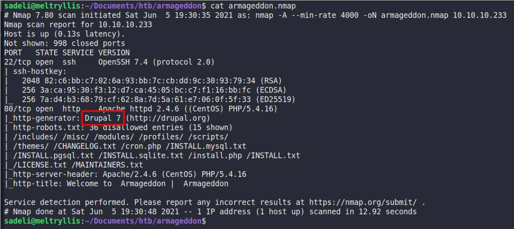

The web application on `http://10.10.10.223` is somewhat minimal.
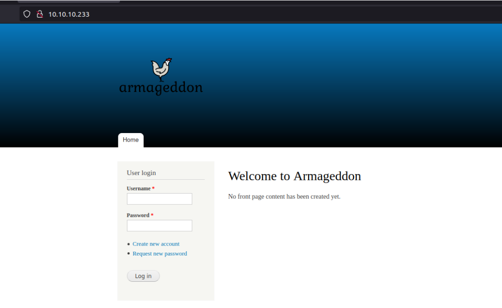

## Exploitation and user.txt

Searching exploitdb for Drupal 7 shows a large number of potential exploits. After some trial and error, Drupalgeddon2 worked.
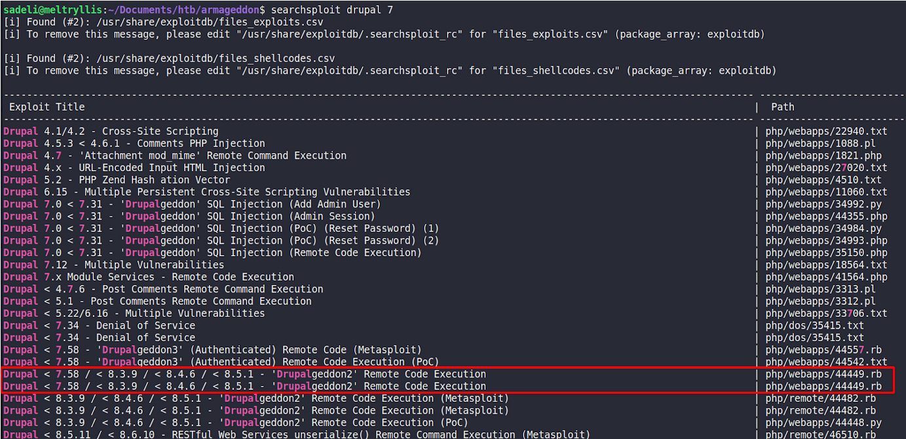
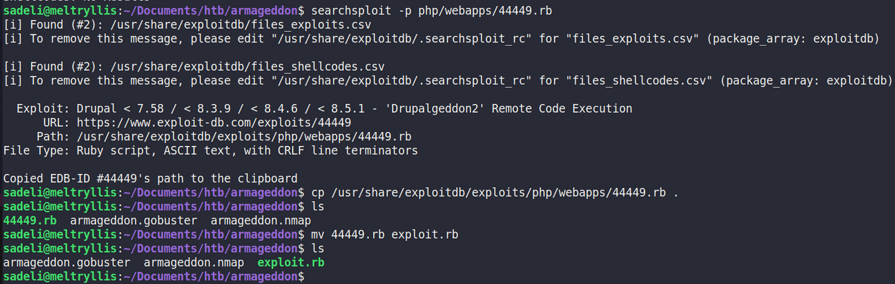

Run the exploit with `ruby exploit.rb http://10.10.10.223/`
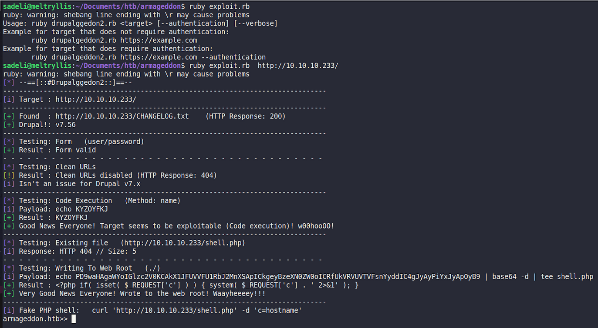

Viewing the contents of `.gitignore` shows that `settings*.php` may contain sensitive info.
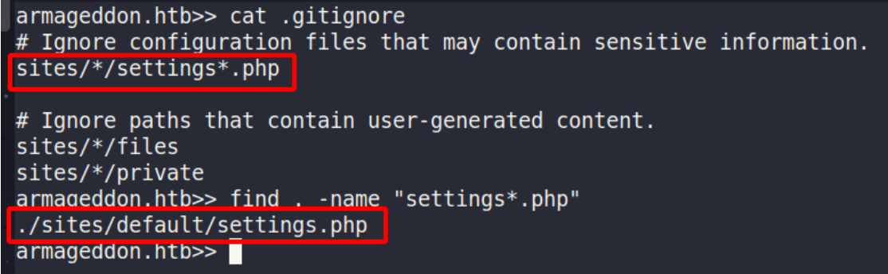

View the contents of `./sites/default/settings.php` to reveal credentials.
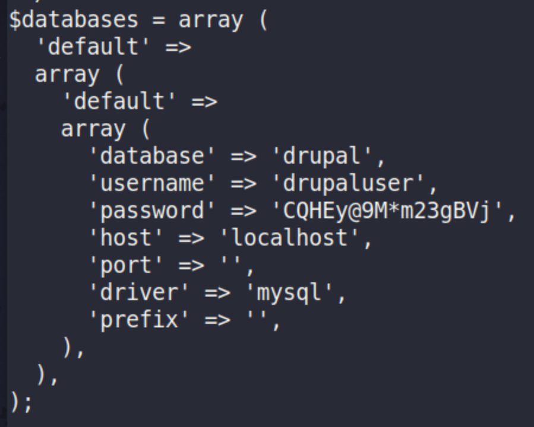

Use the creds `drupaluser:CQHEy@9M*m23gBVj` to read the contents of the drupal database.
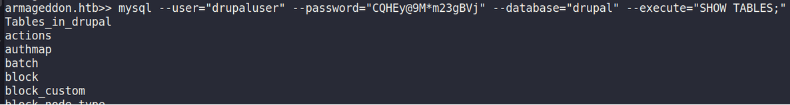

Show the contents of the `users` table. It reveals a user named `brucetherealadmin` and a password hash.
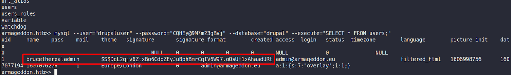

Cracking the password with mode 7900 gets the creds `brucetherealadmin:booboo`
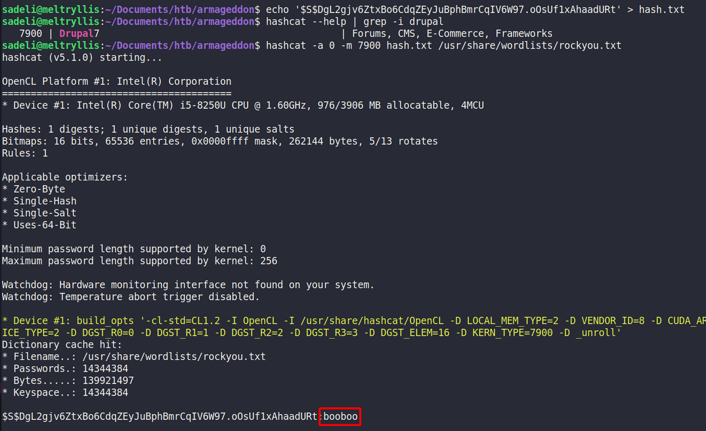

SSH into the machine using those creds.
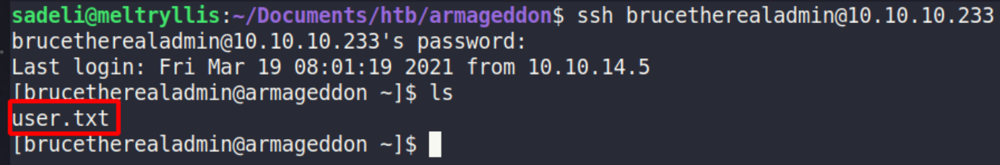

## Privilege Escalation and root.txt
Running `sudo -l` shows that the user can run `/usr/bin/snap install *` as root without a password.
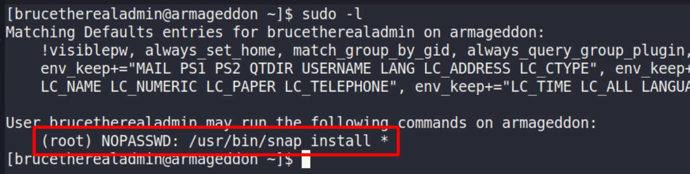

The gtfobins entry for snap privilege escalation requires `fpm`, which is not installed on the box.
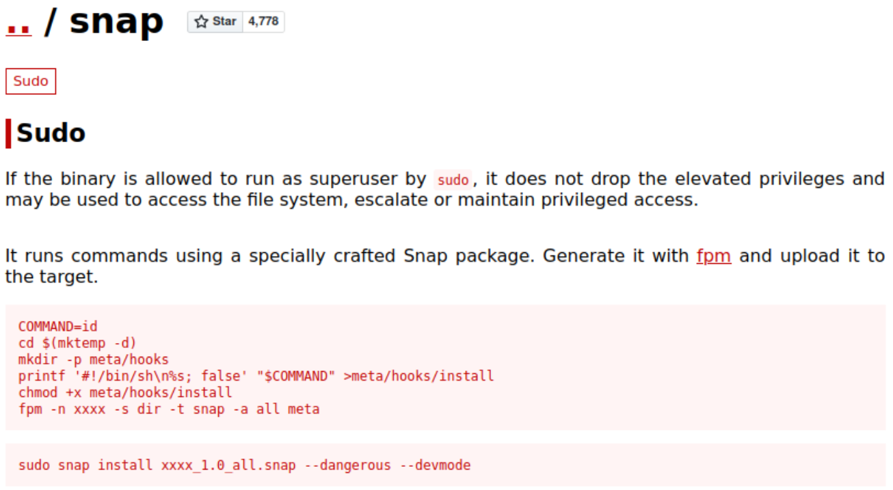

Instead, a search in exploitdb for snap shows a local privilege escalation exploit.
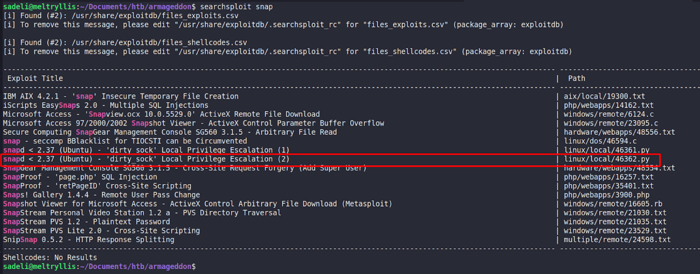

Copy the privesc exploit and upload it to the Armageddon box.
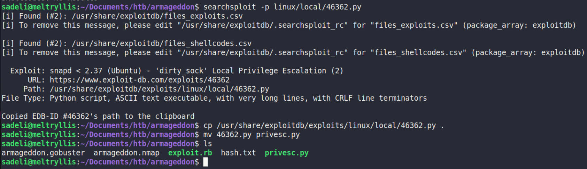
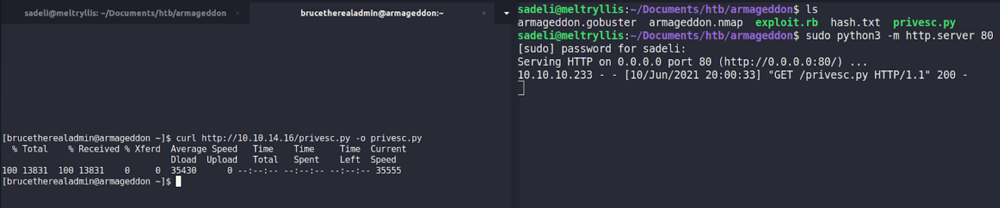

Modify the DirtySock Exploit
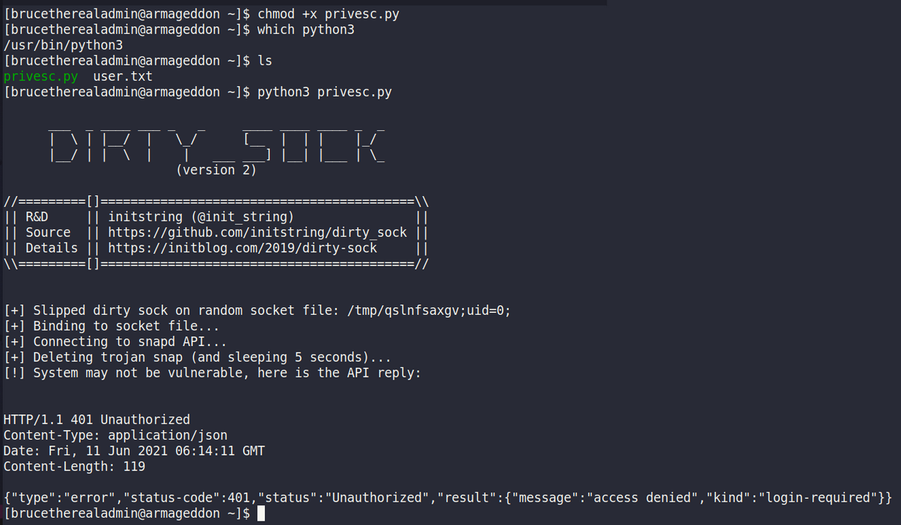
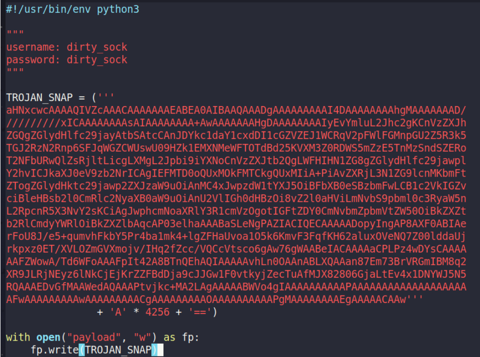

Base64 decode the payload into a file.
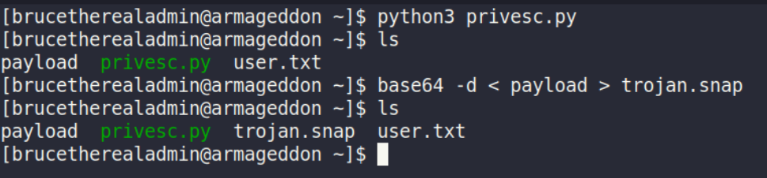

Install the snap like shown in gtfobins.
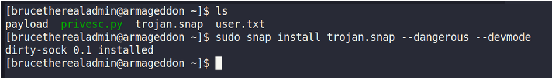

Change user with creds `dirty_sock:dirty_sock` who can run all commands without a password.
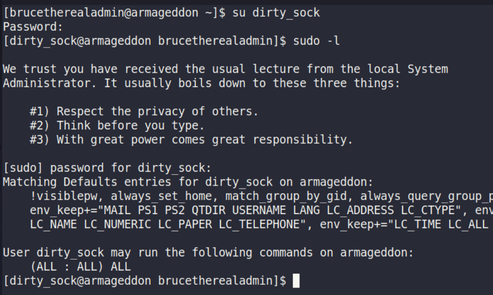
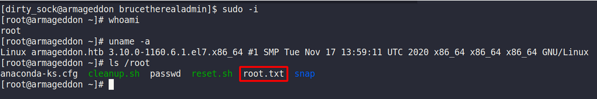
