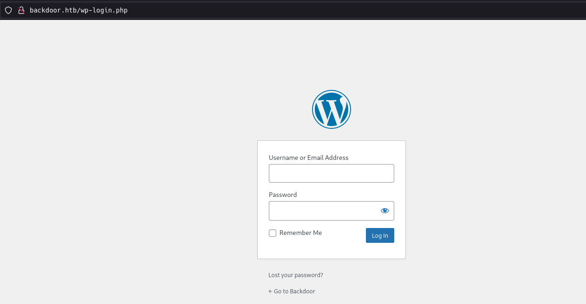
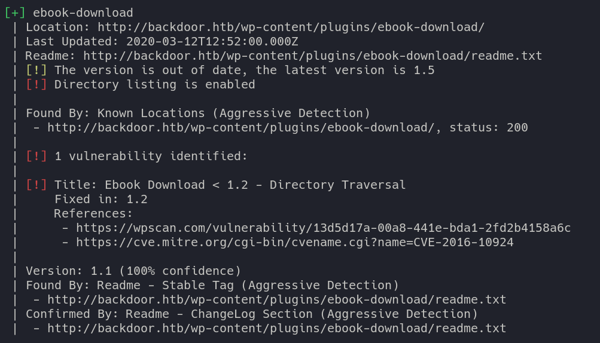
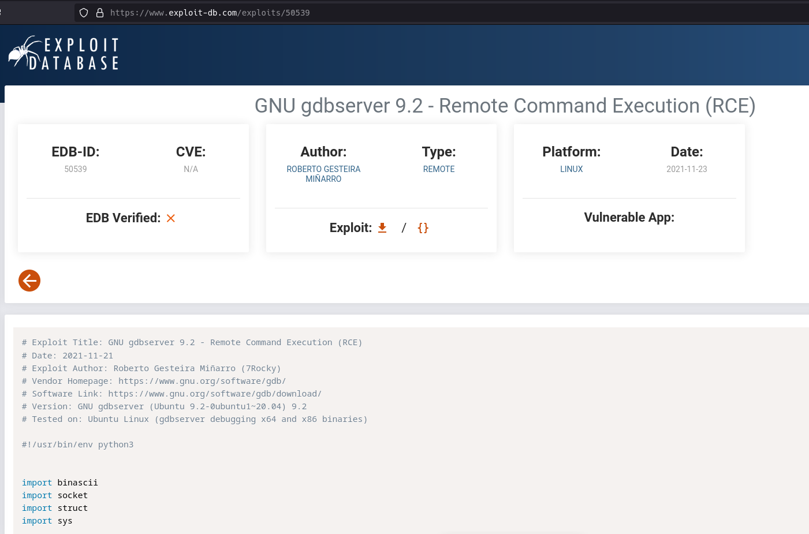

# HACKTHEBOX: Backdoor

*Backdoor* was an easy difficulty Linux box. It was running a wordpress site on port 80 and an unknown service running on port 1337. The wordpress site was vulnerable to directory traversal (CVE-2016-10924), which allows an attacker to enumerate through the filesystem.
Enumerating through all the running processes via `/proc/$pid/cmdline` shows all commands running on the remote server. Doing so discovers that `gdbserver` was running on port 1337, which was vulnerable to remote code execution.
After exploiting RCE to gain access to the box, an attacker could attach themselves to a detatched screen session running from the root user.

## Recon and Enumeration
First, start with an nmap scan. It reveals Wordpress 5.8.1 running on port 80 and some service (waste?) running on port 1337.


##### Enumerating port 80
Visiting `http://backdoor.htb/wp-login.php` confirms that this is a wordpress site.



Next, run this command to aggressively scan for wordpress vulnerabilities (anyone can grab a temporary email address and sign up to get a temporary wpscan API token).
```
wpscan -e --url "http://backdoor.htb" --detection-mode aggressive --plugins-detection aggressive --plugins-version-detection aggressive --api-token <TOKEN>
```


`wpscan` found a directory traversal vulnerability in the ebook-download plugin (CVE-2016-10924).


Exploitdb has a PoC for the directory traversal to read the `wp-config.php` file, which contains mysql creds. Running `curl 'http://backdoor.htb/wp-content/plugins/ebook-download/filedownload.php?ebookdownloadurl=../../../wp-config.php'` reveals database creds.


The directory traversal can read all the way to `/etc/passwd` so traversal all the way to the `/` directory is confirmed. There are two users with bash as a default shell: `root` and `user`.


Unfortunately, `/home/user/.ssh/id_rsa` either does not exist or is not readable.


##### Enumerating port 1337
Making a simple netcat connection to port 1337 doesn't reveal anything.


To find out what may be running on port 1337, directory traversal can be used to enumerate running processes on the remote server. To quote the man page:
> The proc filesystem is a pseudo-filesystem which provides an interface to kernel data structures.  It is commonly mounted at `/proc`.

A quick script can be written to enumerate through `/proc/$pid/cmdline`, which is a file that contains the command that launched the process with `$pid`.

The script [backdoor.go](backdoor.go) uses the directory traversal vulnerability to loop through files `/proc/0/cmdline`, `/proc/1/cmdline`, ..., `/proc/1000/cmdline`. If the cmdline contains the string `1337`, then it suggests that the command specified `1337` as a command line argument (which *might* work because port `1337` isn't a very common default port).

In the output below, the script found one process with PID 842 that contains the string `1337`


Reading the output file shows the contents of `/proc/842/cmdline`, which shows the command running the process with PID 842. It appears to be the command:
```
sh -c while true; do su user -c "cd /home/user;gdbserver --once 0.0.0.0:1337 /bin/true;";
```


This shows that `user` is running `gdbserver` on port `1337`.

## Exploitation and user.txt
A quick google search for gdbserver exploits shows a remote code execution python script.


Running this script from exploitdb drops a reverse shell as `user`. The script also comes with instructions on script setup and execution.


Upgrade the netcat shell with:
```
python3 -c "__import__('pty').spawn('/bin/bash')"
^Z
stty -echo raw
fg
export TERM=xterm
```
and grab the user flag.


## Privilege escalation and root.txt
List the running processes with `ps auxf | less`. Shown below are two cronjobs. The first cronjob is the gdbserver. The second cronjob is new, and it shows that the user `root` is running the command
```
while true; do sleep 1; find /var/run/screen/S-root/ -empty -exec screen -dmS root \;; done
```

That command searches the `/var/run/screen/S-root` directory, which stores the existing screen sessions. If it is empty (meaning there are no screen sessions), then it executes the command `screen -dmS root` which runs a detached screen session as root, simply titled `root`.

Use `ls -l` to view the permissions of `/usr/bin/screen`. The file has the suid bit, which means that `user` can execute screen as the user owner, `root`.

All that is left is to attach to the `username/sessionname` screen. In this case, `screen -x root/root`


