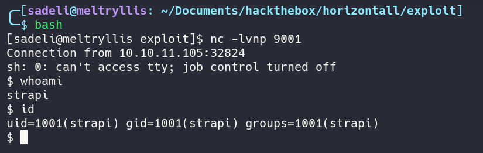

# HACKTHEBOX: Horizontall

Horizontall is vulnerable to unauthenticated RCE.
Local to the box is a Laravel web server running as root, which is also vulnerable to RCE.

## Recon and Enumeration
Nmap scan reveals a web application on port 80 with a name of `http://horizontall.htb`

Use inspect element to find that there is a method called `getReviews`. It makes a request to `http://api-prod.horizontall.htb/reviews`

Visit the host `http://api-prod.horizontall.htb`. It's a very minimalistic `Welcome` so running a ffuf scan will give more info.

Looking at the ffuf scan shows an admin page running `strapi`.

## Exploitation and user.txt

A quick search for strapi on exploitdb shows that version 3.0.0-beta.17.4 is vulnerble to unauthenticated remote code execution. [Here is a scripted exploit](https://www.exploit-db.com/exploits/50239) for the vulnerability.

Running the exploit gives a blind RCE. Running `ping -c 5 <attacker ip>` confirms the code execution

Use the RCE to get a reverse shell.

The user.txt flag in `/home/developer` is readable by all users.

## Privilege Escalation and root.txt
Running `netstat -tulpn` hows the listening ports. Port 3306 is sql, 1337 is the exploit shell, but 8000 is unknown.

It appears that the service on 8000 is a Laravel web app, which can be found via either curl or port forwarding. This screenshot shows port 8000 forwarded to localhost to see that Laravel at version 8, which is vulnerable to remote code execution according to `CVE-2021-3129`. 

[Here is a scripted exploit](https://github.com/ambionics/laravel-exploits) for the vulnerability. Following the instruction in the readme, and changing `id` to a reverse shell payload drops a reverse shell as root.

