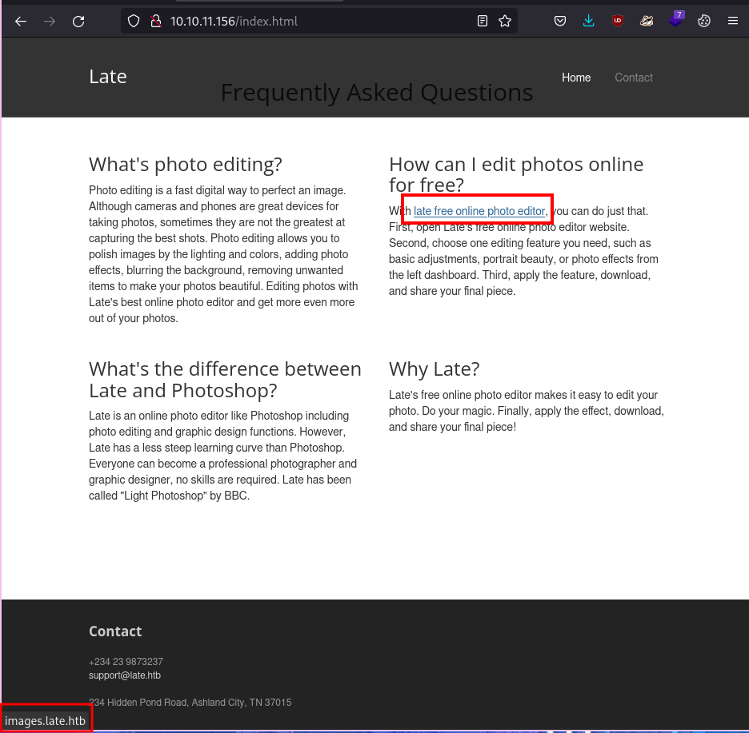

# HACKTHEBOX: Late

Late is a easy difficulty Linux box.
There is an Nginx web app with an `images.late.htb` virtual host running a python Flask web app.
The web app's main feature is accepting an image from a user, extracting text, and returning a result in an HTML template.
The web app is vulnerable to Server-side Template Injection (SSTI), which can be exploited by submitting an image with a simple SSTI payload.
The attacker can exploit SSTI to obtain RCE and gain access to the `sgc_acc` user.

There is a file on the machine called `/usr/local/sbin/ssh-alert.sh` which is owned by the `svc_acc` user AND is called by the SSH PAM configuration.
Since the `ssh-alert.sh` script has the `append` attribute, the `svc_acc` user can append any shell command to the script, which will be executed as `root` every time some user authenticates via SSH.

## Reconnaissance and Enumeration
First, run an nmap scan on the box. It shows SSH open on port 22, and an Nginx web app on port 80.


There is a web app:


There is a link to a `Contact` page, but the form doesn't do anything.


The only html pages feroxbuster finds are `index.html` and `contact.html`, which we already know exist:


Looking at the index page again, there is a link to `images.late.htb`:


Running a FFuF scan shows that the `images` subdomain is the only virtual host we can find right now.


After adding the entry `10.10.11.156 late.htb images.late.htb` to `/etc/hosts`, we can check out the new web app.


Simply upload an image, and the app will respond with text extracted from the image.
The web app extracts text "FROM AN IMAGE" from the png file.


## Exploitation and user.txt
The web app responded with the results:
```html
<p>eee |

FROM AN IMAGE |
</p>
```
So the app extracts the text using some tool, and inserts the text into HTML.
From that info, we can make an educated guess that the Flask application is using some sort of HTML template to insert the text.
This is commonly vulnerable to Server-side Template Injection, so let's test it.

We can create an image (with GIMP!) that contains a simple SSTI payload, `{{ 7*7 }}`:


The payload gets evaluated as `49`, so lets try to get command injection.
The [Payloads all the Things](https://github.com/swisskyrepo/PayloadsAllTheThings/tree/master/Server%20Side%20Template%20Injection#jinja2---remote-code-execution) repo has a giant cheatsheet with SSTI payloads.
Using one of the RCE payloads confirms command injection via SSTI.


Finally, we can insert a reverse shell payload in to the image do get access to the box as the user `svc_acc`.


## Privilege Escalation and root.txt
A simple `sudo -l` doesn't work because I don't know the password.
After searching for files owned by the user `svc_acc`, there's a lot of fluff that's not interesting.


We can use `grep` to get rid of the `/home/svc_acc` directory, the `/run/`, `/proc/`, `/sys/fs/`, and `/var/lib/`.
```bash
find / -user svc_acc 2>/dev/null | grep -v '\/run\|\/proc\|\/home\/svc_acc\|\/sys\/fs\|\/var\/lib'
```

We get a file owned by our user, called `/usr/local/sbin/ssh-alert.sh`


We don't know if this file is called by root, so we can use `grep` again to search for text files that include the string `ssh-alert.sh`.
We find that the file `/etc/pam.d/sshd` (which is the authentication config for SSH) calls the script.


Given these clues it's likely that the `/usr/local/sbin/ssh-alert.sh` script runs as root, so modifying this file should be the goal.

Looking at the file shows that we have write permissions.


However, after opening the file in `vim`, we can't actually write to the file.


After looking at the attributes of the file, the `a` notes that we can only "append" to the file. We can successfully append a command to the file with `echo`.


Judging by the PAM configuration we saw earlier, we can guess that the script is run by root every time some user authenticates via SSH. Simply ssh into the machine to trigger the script.

